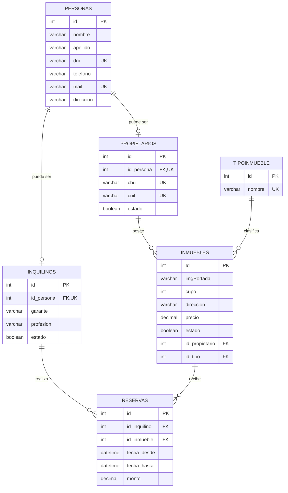

# Sistema de Gestión Inmobiliaria

Aplicación web desarrollada con ASP.NET Core MVC, C# y MySQL para administrar personas, propietarios, inquilinos, inmuebles y reservas.

## Integrantes

| Nombre y apellido |
| ----------------- |
| Victor Malovini   |

## Estado del proyecto

- Propietarios: ABM completo.
- Inquilinos: ABM completo.
- Tipos de inmueble: ABM completo.
- Inmuebles: ABM completo, asociado a propietarios y tipos.
- Reservas: ABM completo, asociado a inquilinos e inmuebles.
- Contratos y alquileres: próximamente.

## Módulos web

- `/Propietarios`: gestión de propietarios.
- `/Inquilinos`: gestión de inquilinos.
- `/TiposInmueble`: gestión de tipos de inmueble.
- `/Inmuebles`: gestión de inmuebles con selección de propietario y tipo.
- `/Reservas`: gestión de reservas con selección de inquilino e inmueble.

Las reservas validan que la fecha de finalización sea posterior a la fecha de inicio. Los formularios utilizan listas cargadas desde la base de datos para mantener las relaciones entre tablas.

## Requisitos

- .NET SDK 10.0.
- MySQL 8 o MariaDB, disponible localmente en el puerto `3306`.
- XAMPP, DBeaver o phpMyAdmin para ejecutar el script.

## Base de datos

El script [DataBase/inmobiliaria_lab2.sql](DataBase/inmobiliaria_lab2.sql) crea la base `inmobiliaria_lab2`, sus tablas, relaciones y datos de prueba.

### Desde DBeaver o phpMyAdmin

1. Inicia el servicio MySQL.
2. Abre `DataBase/inmobiliaria_lab2.sql` en el gestor.
3. Ejecuta el script completo. No es necesario crear la base manualmente.

### Desde la consola de MySQL

```bash
mysql -u root -p < DataBase/inmobiliaria_lab2.sql
```

Con la instalación predeterminada de XAMPP, el usuario suele ser `root` y la contraseña queda vacía. La aplicación utiliza la conexión `DefaultConnection` definida en `appsettings.json`; modifica ese archivo si tus credenciales son diferentes.

## Ejecutar la aplicación

Desde la carpeta raíz del proyecto:

```bash
dotnet restore
dotnet run
```

Abre en el navegador la URL que muestre la consola, por ejemplo `http://localhost:5057`.

## Diagrama Entidad-Relación



También se incluye el archivo editable [Diagrama/Entidad-Relacion.drawio](Diagrama/Entidad-Relacion.drawio).
